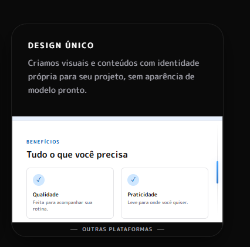

# Card 01 — criação visual

**Status:** título e descrição aprovados e aplicados; demonstração visual em duas cenas implementada.

**Numeração:** ordem em que as ideias foram registradas, não posição final no grid.

## Papel na seção

Um dos seis cards da seção “Uma ideia. A MakePloy entra em ação.” deve mostrar a criação visual da plataforma. O texto aprovado e a primeira cena visual estão no terceiro card.

## Ideia que o card deve passar

A MakePloy ajuda a criar páginas e interfaces com identidade própria. A pessoa pode ajustar o visual e os detalhes para que o resultado combine com o que imaginou, em vez de ficar com uma aparência genérica.

O card deve mostrar essa diferença de forma concreta no texto e na animação. A mensagem deve destacar a qualidade do resultado e a liberdade de edição com palavras simples, sem chamar outras ferramentas de “feias”.

## Texto aprovado

**Título:** DESIGN ÚNICO

**Descrição:** Criamos visuais e conteúdos com identidade própria para seu projeto, sem aparência de modelo pronto.

## Demonstração visual

A primeira cena apresenta uma página de venda genérica para a garrafa térmica fictícia Flow: navegação, apresentação do produto, benefícios, oferta com preço e rodapé. Uma barra discreta de navegador faz a transição entre o fundo preto do card e a página em azul claro e branco. O cursor arrasta a barra de rolagem, clica em “Criar com MakePloy”, segura a mini página e a lança para fora do card.

A segunda cena mostra o mesmo produto em uma página com identidade própria: composição editorial, paleta verde, tipografia expressiva, ilustração do produto e movimento sutil. A nova página entra enquanto a primeira sai. O rótulo inferior muda de “Outras plataformas” para “Criado com MakePloy”. A animação respeita a preferência por movimento reduzido.

## Relação com o restante da página

Outras seções já apresentam a criação visual e dizem que a MakePloy não usa a mesma resposta para todos. Este card deve avançar a história: mostrar como essa liberdade aparece no visual que a pessoa cria.

## Próximas decisões

- Definir a posição final do card na sequência dos seis cards.

O título, a descrição e as duas cenas foram aplicados. A posição final do card ainda não foi definida.
